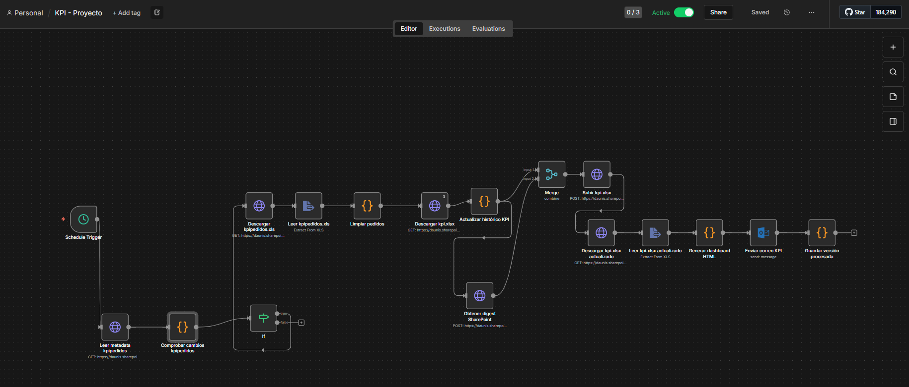
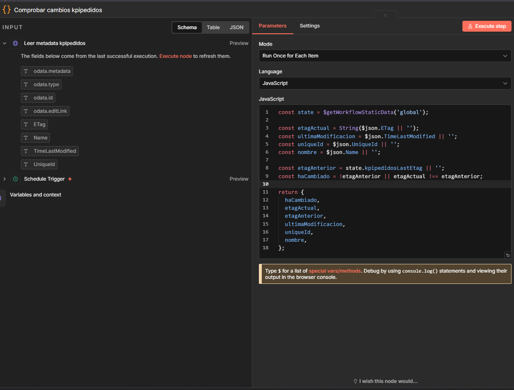
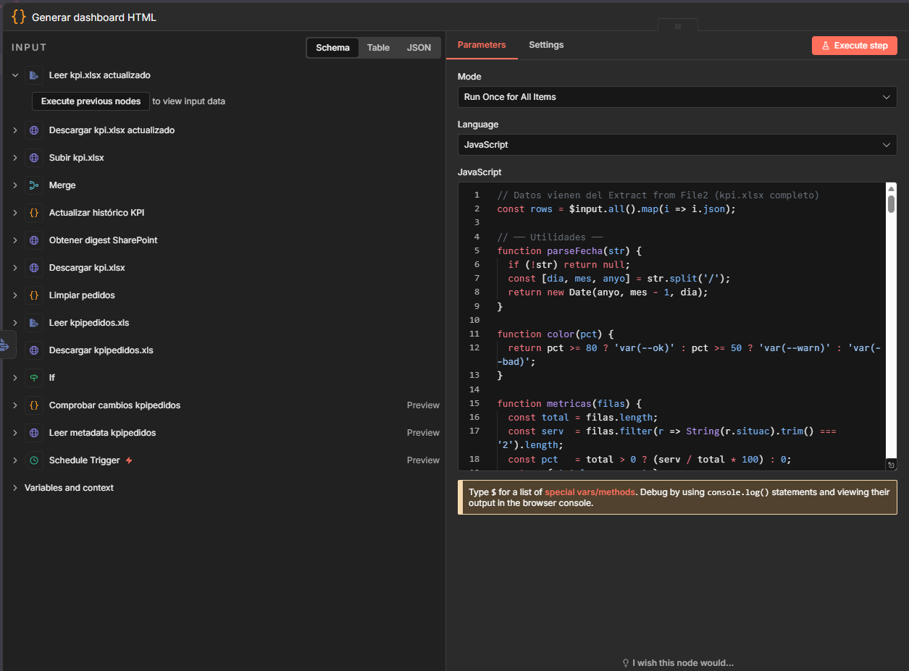
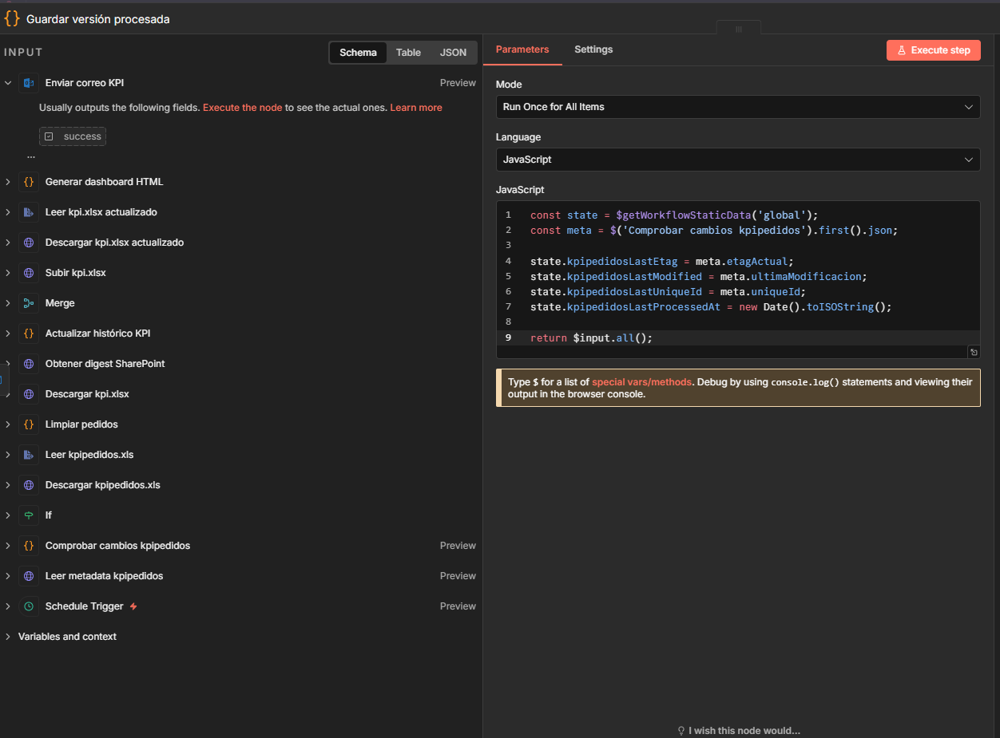

# KPI Automation with n8n

Automatización de reporting KPI con n8n, orientada a procesar datos desde SharePoint, actualizar un histórico en Excel, generar un dashboard HTML y enviarlo automáticamente por correo.

## Descripción

Este proyecto consiste en un flujo automatizado desarrollado en n8n para procesar información operativa y transformar un fichero de entrada en un dashboard visual listo para enviar por email.

La automatización permite:
- detectar si el archivo fuente ha cambiado
- descargar y procesar los datos
- actualizar un histórico en Excel
- generar un dashboard HTML con métricas resumidas
- enviar el resultado automáticamente por correo
- guardar el estado procesado para evitar reprocesados innecesarios

## Objetivo

El objetivo del proyecto fue reducir trabajo manual, asegurar consistencia en el tratamiento de datos y automatizar la generación y envío de dashboards KPI de forma repetible y controlada.

## Tecnologías utilizadas

- n8n
- SharePoint
- Excel
- Outlook
- JavaScript
- HTML
- Automatización de procesos

## Flujo de funcionamiento

1. El workflow se ejecuta con un trigger programado.
2. Se consulta la metadata del archivo fuente en SharePoint.
3. Se comprueba si el archivo ha cambiado mediante ETag.
4. Si hay cambios, se descarga el fichero origen.
5. Se limpian y transforman los datos.
6. Se actualiza el histórico KPI.
7. Se genera un dashboard HTML con los datos procesados.
8. Se envía el resultado automáticamente por correo.
9. Se guarda la versión procesada para no reprocesar la misma entrada.

## Lógica principal

### Detección de cambios
Se compara el ETag actual del archivo con el último ETag procesado para decidir si el flujo debe continuar.

### Procesado de datos
Se descargan los datos de entrada, se limpian y se incorporan al histórico KPI.

### Generación del dashboard
Se crea un dashboard HTML con métricas resumidas y tablas para visualización rápida.

### Envío automatizado
El resultado final se envía por correo mediante Outlook.

### Persistencia de estado
Se guarda la versión procesada para evitar ejecuciones innecesarias sobre el mismo archivo.

## Capturas del proyecto

## 1. Workflow completo
Vista general del flujo automatizado en n8n.

## 2. Control de cambios por ETag
Nodo encargado de comprobar si el archivo fuente ha cambiado antes de ejecutar el resto del proceso.

## 3. Generación del dashboard HTML
Bloque donde se construye el dashboard visual que resume los datos KPI.

## 4. Guardado de versión procesada
Paso final donde se actualiza el estado global para registrar qué versión del archivo ya ha sido tratada.

## Resultados

Con esta automatización se consiguió:
- evitar tareas manuales repetitivas
- controlar si el archivo fuente había cambiado antes de procesarlo
- mantener actualizado el histórico KPI
- generar dashboards visuales automáticamente
- enviar la información por correo de forma automática
- mejorar fiabilidad y trazabilidad del proceso

## Qué he hecho yo

En este proyecto me encargué de:
- diseñar el flujo completo en n8n
- integrar SharePoint como origen de datos
- implementar la lógica de detección de cambios por ETag
- procesar y limpiar los datos
- actualizar el histórico KPI
- generar el dashboard HTML
- automatizar el envío por correo
- guardar el estado procesado para evitar duplicados

## Notas

Por motivos de confidencialidad, las capturas publicadas en este repositorio han sido anonimizadas y no incluyen información sensible del entorno original.

## Autor

**Ibrahem Laktibi**
